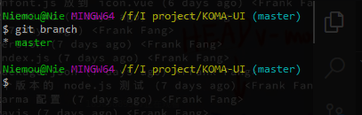
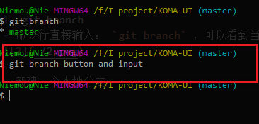
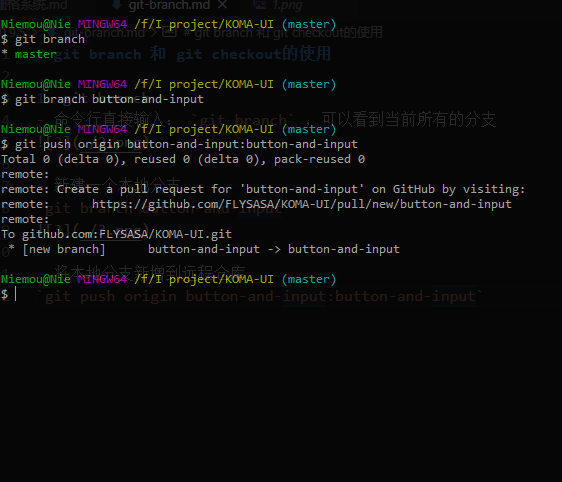
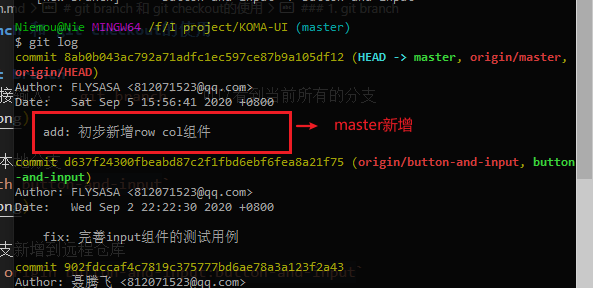
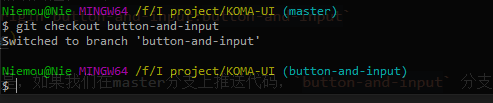
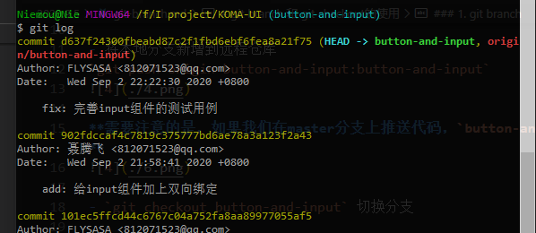

# git branch 和 git checkout的使用

### 1. git branch
- 命令行直接输入： `git branch` ，可以看到当前所有的分支

- 新建一个本地分支
`git branch button-and-input`

- 将本地分支新增到远程仓库
`git push origin button-and-input:button-and-input`

**需要注意的是，如果我们在master分支上推送代码，`button-and-input` 分支并不会新增代码**

- `git checkout button-and-input` 切换分支

分支概念：

