# 栅格系统

### 1.什么是栅格系统？
将一个div分成多份
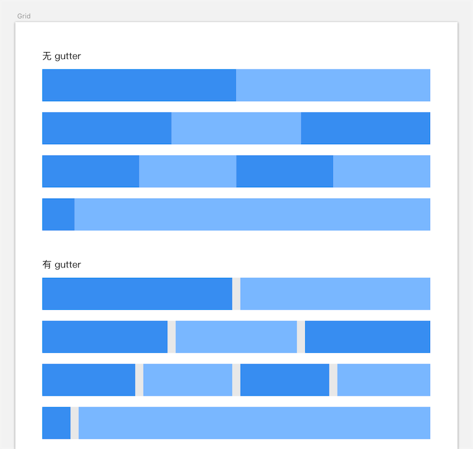

### 2.设计栅格系统

这里有个css样式的控制可以学习一下，当绑定了一个`data-span`属性时，可以写样式 `.col[data-span]`
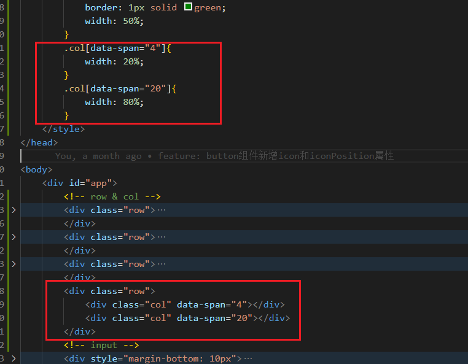

**核心原理就是：分成24份，每一份的宽度就是1/24**

### 3.如何使用less循环写样式？

#### 给col加入span属性：
```
.col{
  height: 100px;
  background: gray;
  width: 50%;
  border: 1px solid green;
  // &.col-1{
  //   width: 1/24%;
  // }
  @class: col-;
  .col-loop(@n) when (@n>0){
    &.@{class}@{n}{
        width: @n/24*100%;
    }
    .col-loop((@n)-1);
  }
  .col-loop(24)
}
```

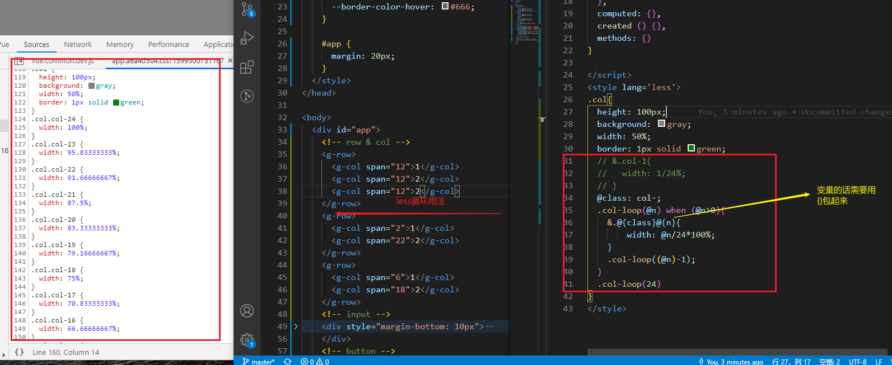

加入span属性：
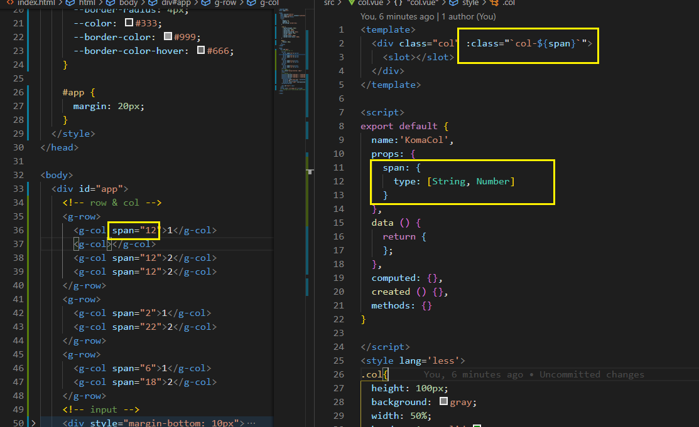

上面的写法不传的话会出现undefined：
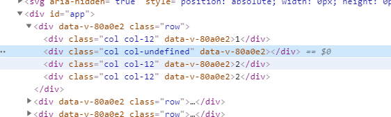

加个&&判断即可：
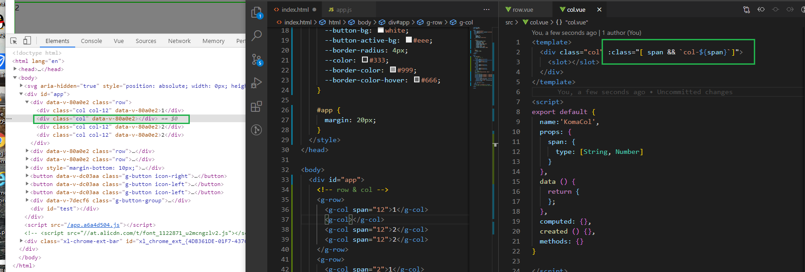

不光class上可以用，其它地方也可以：
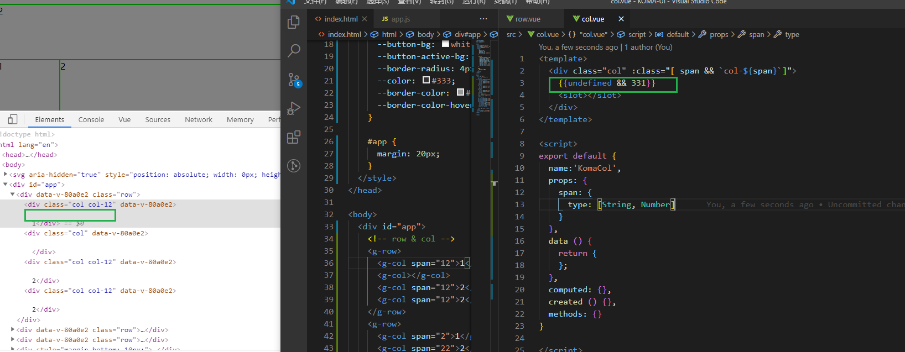

#### 给col加入offset属性：
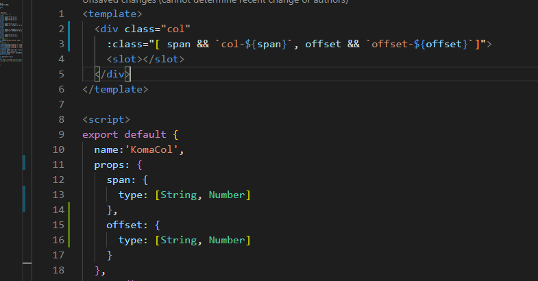
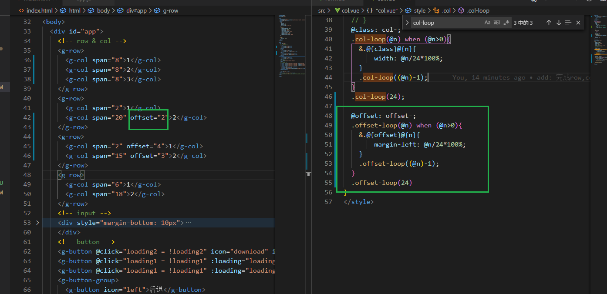


#### 给col加入gutter属性：

*原理：给col一个gutter一半的padding值，这样两个col之间的间隙就是gutter，然后给row一个负margin值也为gutter的一半，以抵消左右多出的padding。*


#### 步骤：
###### 1. 在父组件中给子组件的data里传值
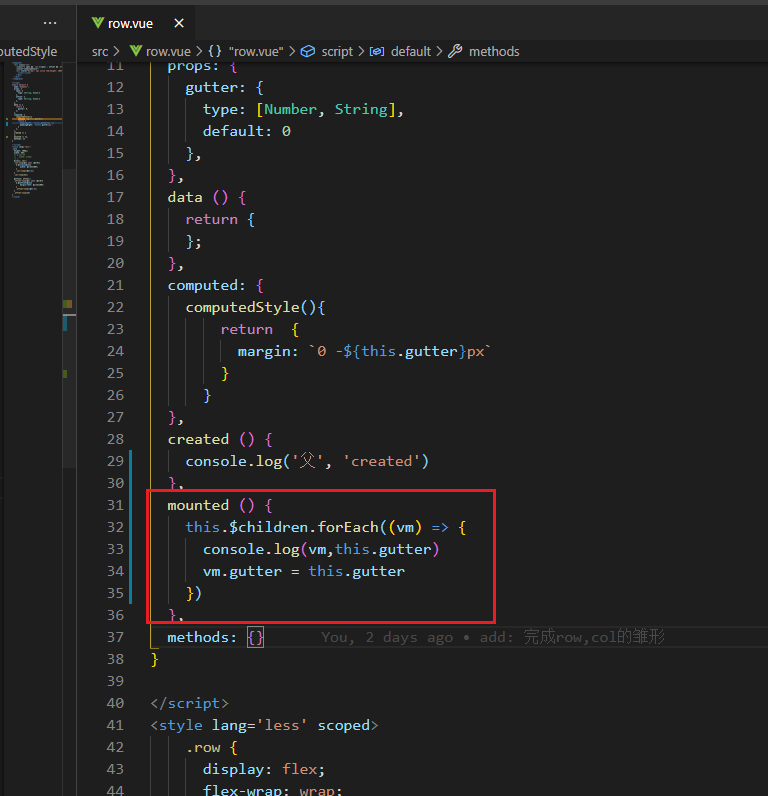

###### 2. 在子组件中用gutter值来给左右padding

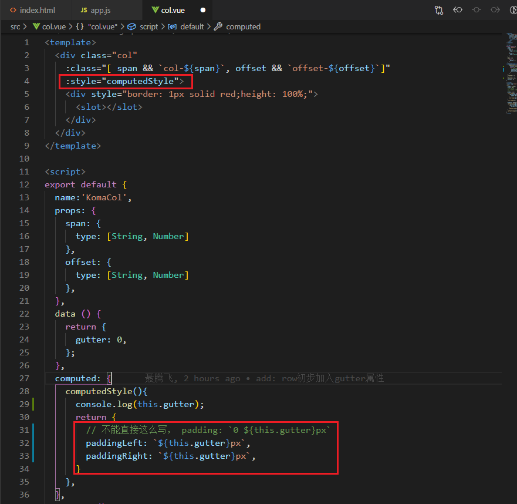


### 4.给col加入响应式
响应式在做的过程中其实实现并不难，核心思路就是，在col上绑定不同的设备尺寸属性，如 `:phone="{span: 12}"`。

然后在col组件里，获取到该属性后计算不同的class
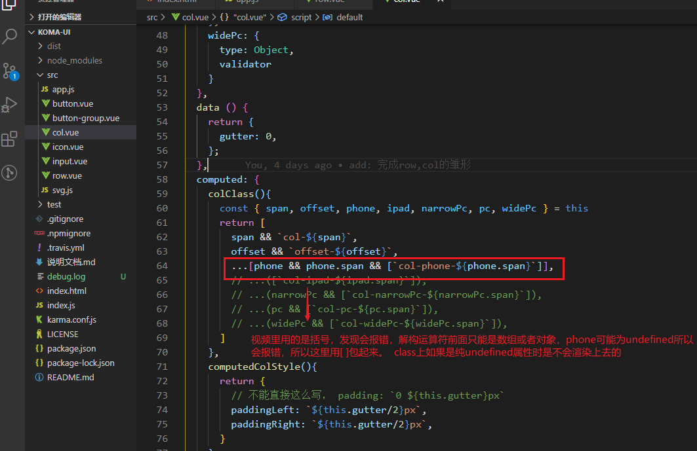

加入媒体查询样式：
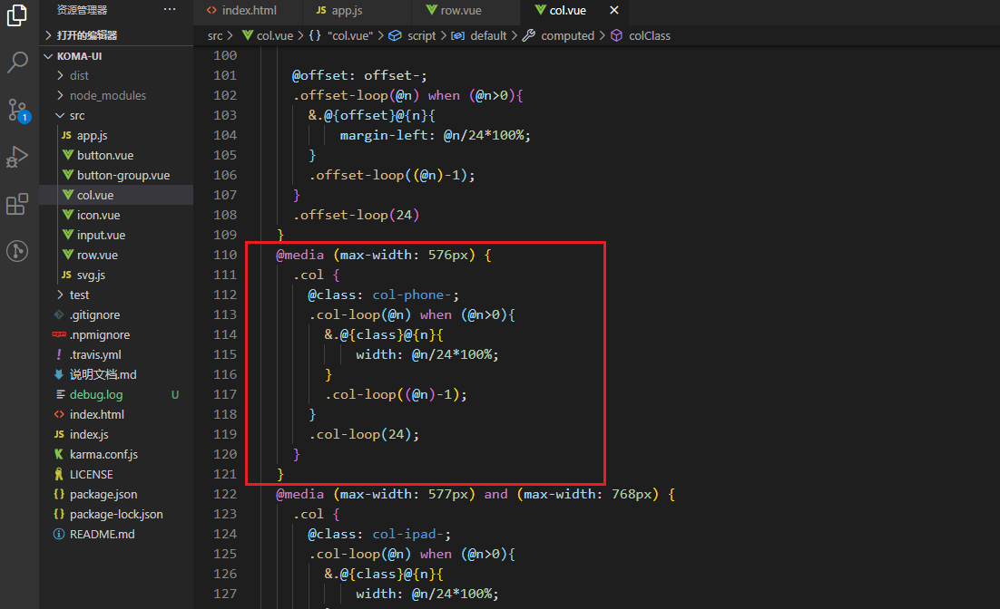


