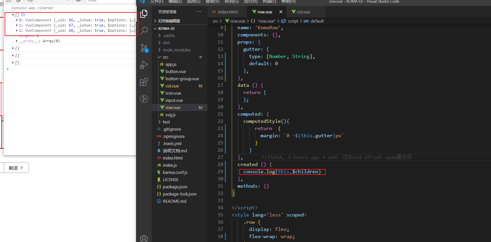
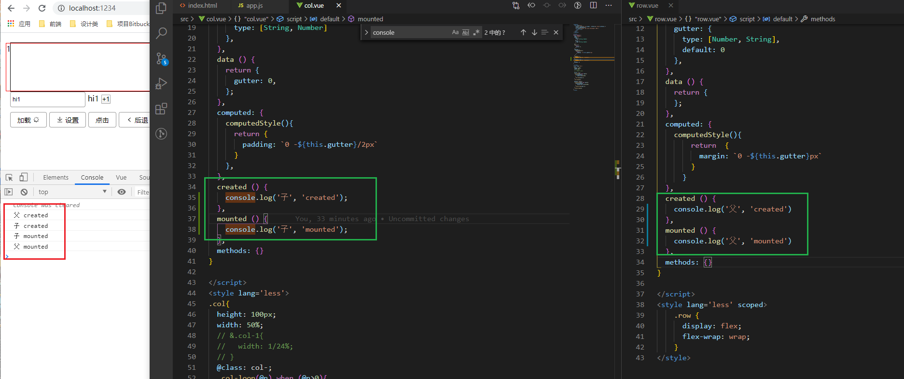

### 父子组件渲染过程
在父组件 row 上使用gutter属性，想把这个 gutter 属性传给其子组件col。 会有时机问题

这里在父组件created里打印子组件, 会发现是空数组，手动展开的时候是才能看到子组件，这是因为父组件创建（created）的时候，子组件是没有挂载的, 后面又挂载了上去。



### vue的created和mounted
```
let div = document.createElement('div')    // created  在内存里生成一个对象
document.body.appendChild(div)             // mounted  把对象挂载到页面上去
```

### 引申一下： 如果有个父子组件，created和mounted的挂载顺序是怎样的？

实验如下：

```
父 created
子 created
子 mounted
父 mounted
```

等于：
```
let div = document.createElement('div')         // 父 created
let childDiv = document.createElement('div')    // 子 created
div.appendChild(childDiv)                       // 子 mounted
document.body.appendChild(div)                  // 父 mounted
```

### 结论：
**我们可以在父组件的mounted钩子里，获取子组件，此时子组件已经全部挂载到了父组件上。**