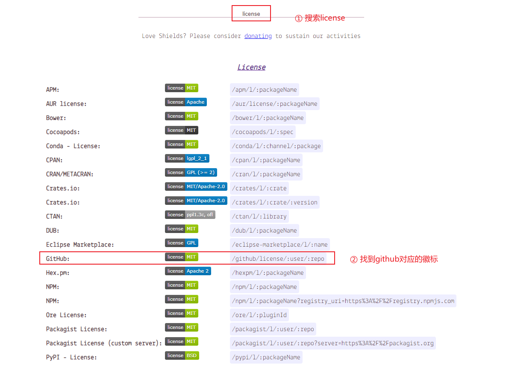
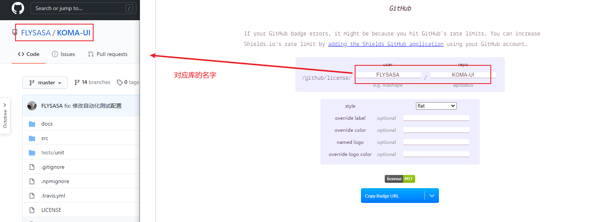
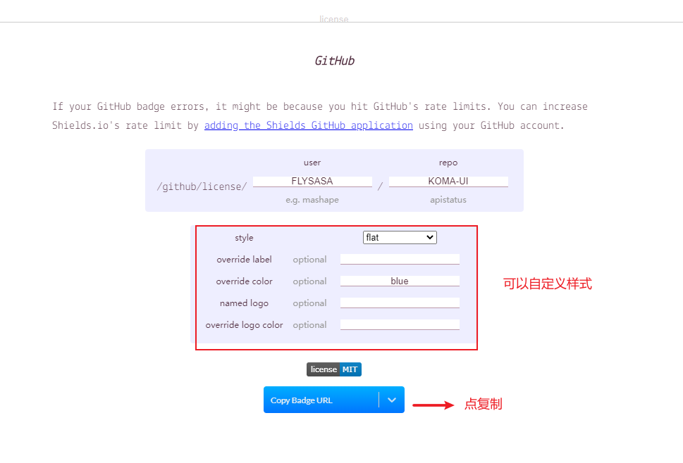
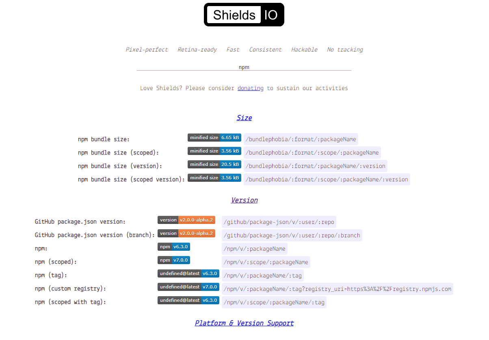
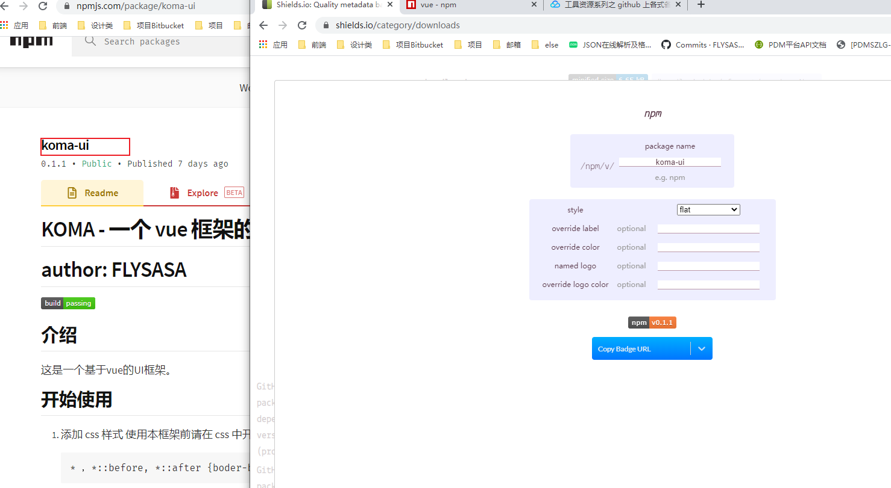
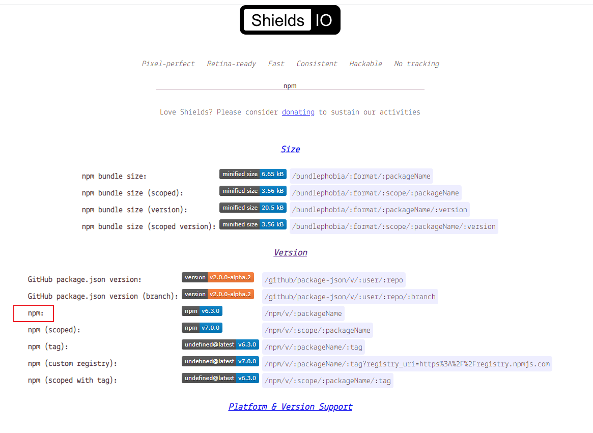
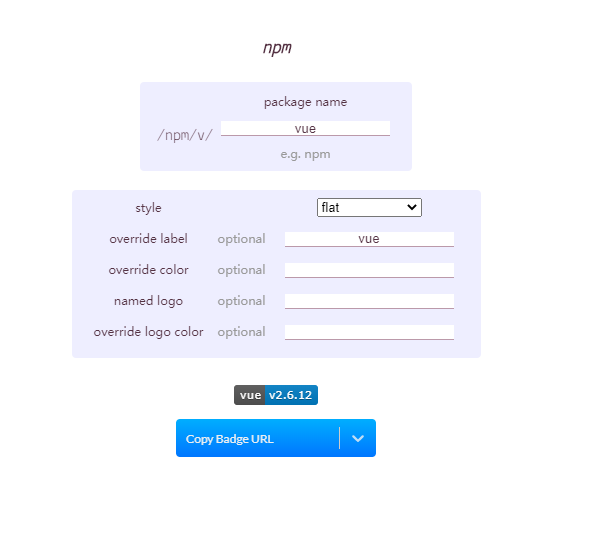

### 制作徽标
参考： https://cloud.tencent.com/developer/article/1450399

在README.md中常常会展示高大上的徽标，比如vue官方文档里：

如何在自己的项目文档里插入这些徽标？

### 1. 插入license MIT徽标
打开网站： https://shields.io/
1. 输入license

2. 输入库的信息

3. 自定义样式后点击复制

### 2. 插入NPM 徽标

### 3. 插入vue 徽标
① 搜索npm

② 输入vue

