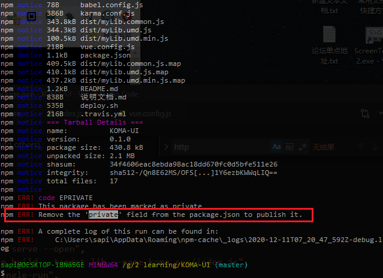
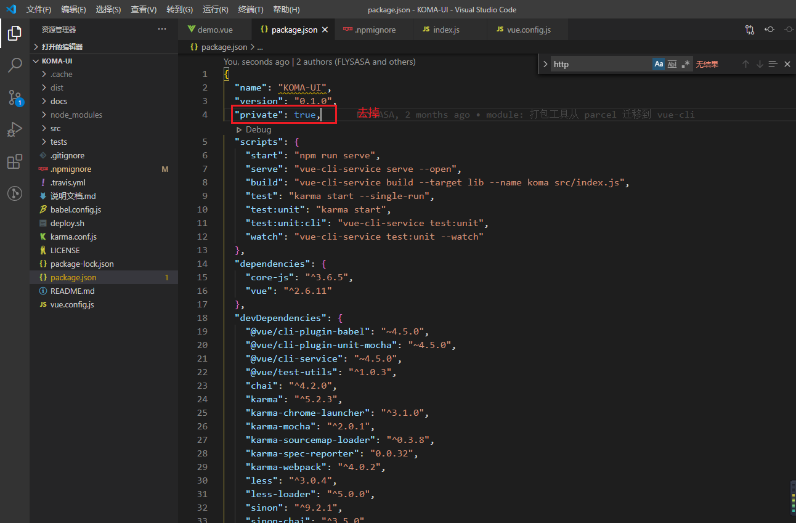
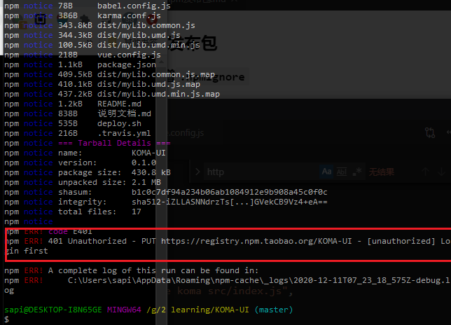
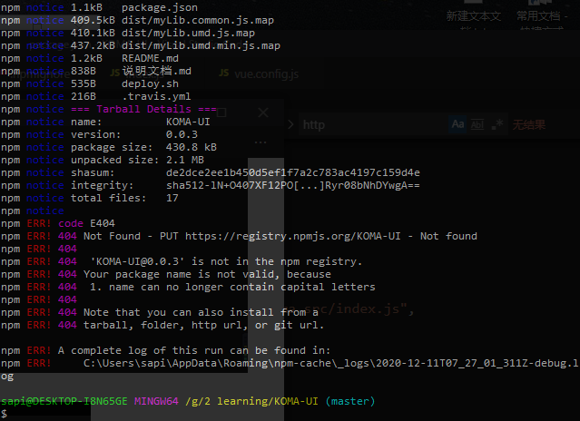
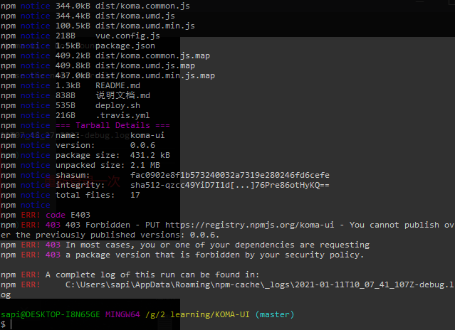
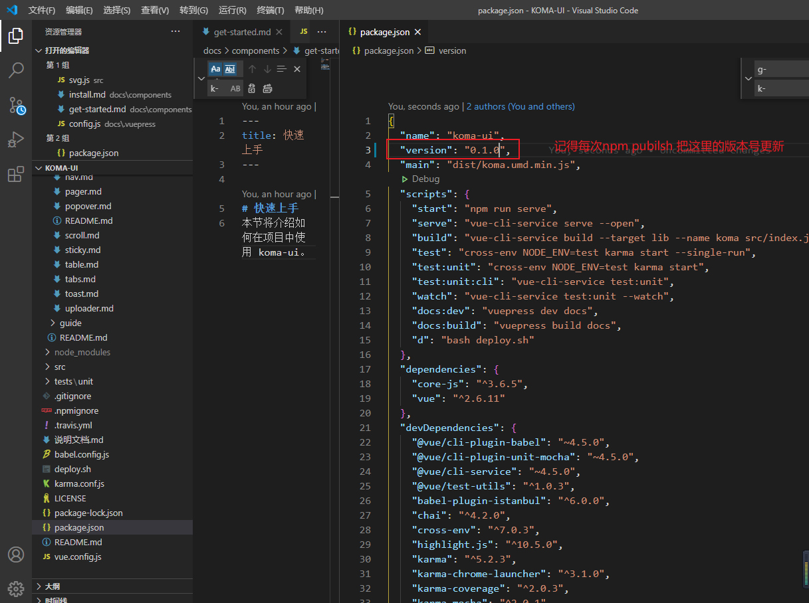
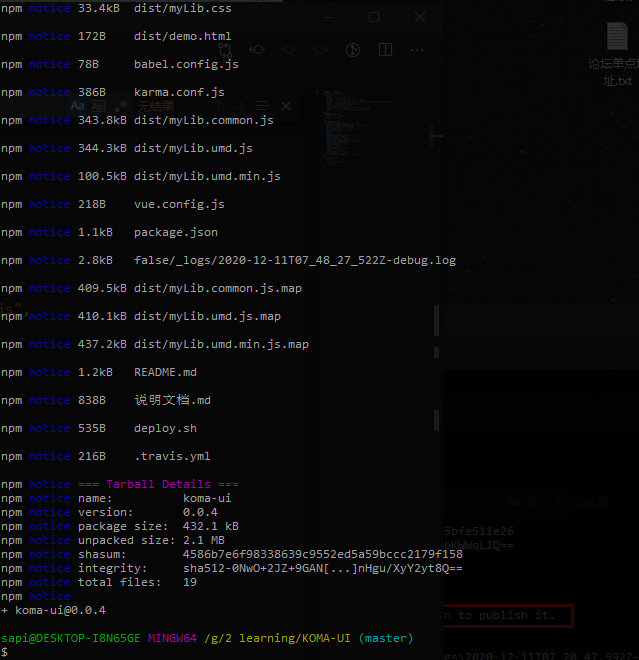

### npm 发布流程

#### 1. 新建index.js输出文件
在项目根目录下新建`index.js`, 导出内容。


#### 2. package.json 入口指向`index.js`


#### 3. 项目根目录下执行`npm addUser`
执行这个的时候记得不要使用淘宝源


#### 4. 新增`.npmignore`
将不需要发布的内容加入到 `.npmignore`。
```
/node_modules/     // 前面加/代表根目录下， 后面加/代表目录
/.cache/
/docs/
/src/
/tests/
```

#### 5. 运行 `npm publish`
项目打完包后执行。


#### 常见的问题汇总：
1. 报错：私人库的问题

**解决：去掉`package.json`里的 `private: true`**


2. 报错：报淘宝源无权限的问题

**解决：设置回淘宝源**
`npm config set registry https://registry.npmjs.org`

3. 报错：Not-found


**解决：登录账号**


4. 报错：403 Forbidden

**解决：更新版本**


5. 发布成功
`npm ublish`

