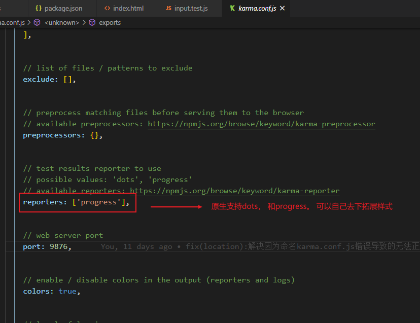

## 测试用例复盘
### 单元测试
>BDD: Behavior Driven Development (行为驱动开发)
>TDD：Test Driven Development (测试驱动开发)
>Assert: 断言

### 从零开始搭建 Karma + Mocha + Sinon 单元测试

1. Karma（[ˈkɑrmə] 卡玛）是一个测试运行器，它可以呼起浏览器，加载测试脚本，然后运行测试用例
2. Mocha（[ˈmoʊkə] 摩卡）是一个单元测试框架/库，它可以用来写测试用例
3. Sinon（西农）是一个 spy / stub / mock 库，用以辅助测试

### 具体步骤：
#### 1. 安装
```
npm i -D karma karma-chrome-launcher karma-mocha karma-sinon-chai mocha sinon sinon-chai karma-chai karma-chai-spies
```

#### 2. 创建`karma.conf.js`，如下：
这个文件有两种创建方法：
一：手动新建 karma.conf.js，内容如下
```js
 module.exports = function (config) {
     config.set({

         // base path that will be used to resolve all patterns (eg. files, exclude)
         basePath: '',
            // frameworks to use
            // available frameworks: https://npmjs.org/browse/keyword/karma-adapter
            frameworks: ['mocha', 'sinon-chai'],
            client: {
                chai: {
                    includeStack: true
                }
            },


            // list of files / patterns to load in the browser
            files: [
                'dist/**/*.test.js',
                'dist/**/*.test.css'
            ],


            // list of files / patterns to exclude
            exclude: [],


            // preprocess matching files before serving them to the browser
            // available preprocessors: https://npmjs.org/browse/keyword/karma-preprocessor
            preprocessors: {},


            // test results reporter to use
            // possible values: 'dots', 'progress'
            // available reporters: https://npmjs.org/browse/keyword/karma-reporter
            reporters: ['progress'],


            // web server port
            port: 9876,


            // enable / disable colors in the output (reporters and logs)
            colors: true,


            // level of logging
            // possible values: config.LOG_DISABLE || config.LOG_ERROR || config.LOG_WARN || config.LOG_INFO || config.LOG_DEBUG
            logLevel: config.LOG_INFO,


            // enable / disable watching file and executing tests whenever any file changes
            autoWatch: true,


            // start these browsers
            // available browser launchers: https://npmjs.org/browse/keyword/karma-launcher
            browsers: ['ChromeHeadless'],


            // Continuous Integration mode
            // if true, Karma captures browsers, runs the tests and exits
            singleRun: false,

            // Concurrency level
            // how many browser should be started simultaneous
            concurrency: Infinity
        })
    }
```

二. 使用karma-cli自动生成
```js
npm i karma -g
npm i karma-cli -D
karma init 
```
选项如下：


**以上两种方式都可以，但是要注意的是手动创建的时候千万不要写错文件名`karma.conf.js` 别少个f啥的，否则到时候karma start并不会报错，但是浏览器不会正常启动，无法自动检测，这个吐血bug一度让我重装了git和node，特别坑。**

#### 3.  将所有的测试用例放在test文件下， 例：创建 `test/button.test.js`  文件
```js
 const expect = chai.expect;
 import Vue from 'vue'
 import Button from '../src/button'

 Vue.config.productionTip = false
 Vue.config.devtools = false

 describe('Button', () => {
     it('存在.', () => {
         expect(Button).to.be.ok
     })
     it('可以设置icon.', () => {
         const Constructor = Vue.extend(Button)
         const vm = new Constructor({
         propsData: {
             icon: 'settings'
         }
         }).$mount()
         const useElement = vm.$el.querySelector('use')
         expect(useElement.getAttribute('xlink:href')).to.equal('#i-settings')
         vm.$destroy()
     })
     it('可以设置loading.', () => {
         const Constructor = Vue.extend(Button)
         const vm = new Constructor({
         propsData: {
             icon: 'settings',
             loading: true
         }
         }).$mount()
         const useElements = vm.$el.querySelectorAll('use')
         expect(useElements.length).to.equal(1)
         expect(useElements[0].getAttribute('xlink:href')).to.equal('#i-loading')
         vm.$destroy()
     })
     it('icon 默认的 order 是 1', () => {
         const div = document.createElement('div')
         document.body.appendChild(div)
         const Constructor = Vue.extend(Button)
         const vm = new Constructor({
         propsData: {
             icon: 'settings',
         }
         }).$mount(div)
         const icon = vm.$el.querySelector('svg')
         expect(getComputedStyle(icon).order).to.eq('1')
         vm.$el.remove()
         vm.$destroy()
     })
     it('设置 iconPosition 可以改变 order', () => {
         const div = document.createElement('div')
         document.body.appendChild(div)
         const Constructor = Vue.extend(Button)
         const vm = new Constructor({
         propsData: {
             icon: 'settings',
             iconPosition: 'right'
         }
         }).$mount(div)
         const icon = vm.$el.querySelector('svg')
         expect(getComputedStyle(icon).order).to.eq('2')
         vm.$el.remove()
         vm.$destroy()
     })
     it('点击 button 触发 click 事件', () => {
         const Constructor = Vue.extend(Button)
         const vm = new Constructor({
         propsData: {
             icon: 'settings',
         }
         }).$mount()

         const callback = sinon.fake();
         vm.$on('click', callback)
         vm.$el.click()
         expect(callback).to.have.been.called

     })
 })
```

#### 4. 创建测试脚本
在 package.json 里面找到 scripts 并改写 scripts
```js
 "scripts": {
     "dev-test": "parcel watch test/* --no-cache & karma start",
     "test": "parcel build test/* --no-minify && karma start --single-run"
 }
```
脚本正常执行： 


#### 5. 运行测试脚本
- 要么使用`npm run test` 一次性运行，看一次结果. 可以直接 `npm test`

- 要么使用 `npm run dev-test` 进行watch运行, 新开命令行窗口可以实时看到测试结果, 这个指令在windows下需要拆开执行


---
### tranvis持续自动化测试
#### 1. 根目录下新建 .travis.yml 文件
```json
language: node_js
node_js:
  - "8"
  - "9"
  - "10"
addons:
chrome: stable
sudo: required
before_install:
  - npm i -g npm  // node 9下老是报装包问题，所以追加了这句
before_script:
  - "sudo chown root /opt/google/chrome/chrome-sandbox"
  - "sudo chmod 4755 /opt/google/chrome/chrome-sandbox"
```

#### 2. travis-ci 关联github项目


关联完后，每次push代码，都会自动测试。

--- 
### 关于测试用例语法使用的详细解析

### 为什么可以支持 describe 和 it?

右侧为`karma.conf.js`配置文件：
由mocha引入，直接挂载在window上的全局函数，可以直接使用。


### 为什么支持 sinon 和 expect ?

`sinon.fake()` 由sinon提供， `expect`语法由chai提供， `calledWith`由 sinon-chai 提供


### 测试用例打印样式？



