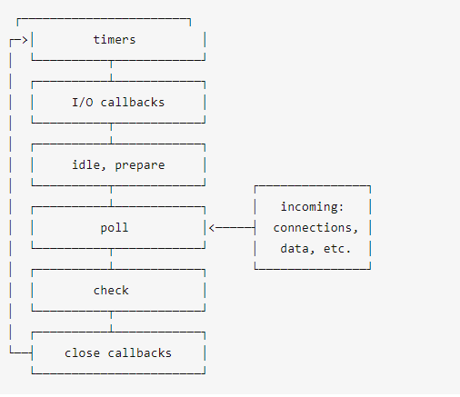
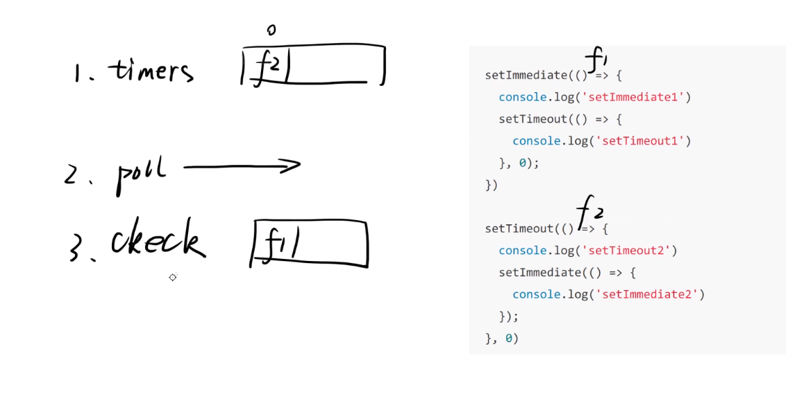
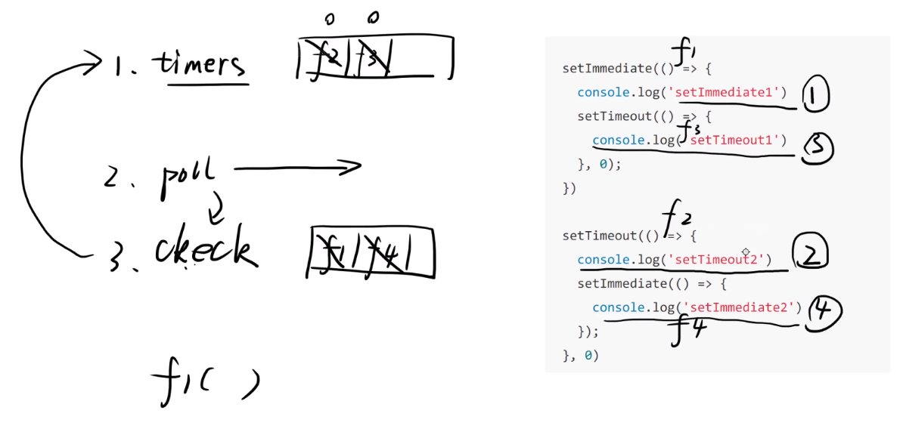
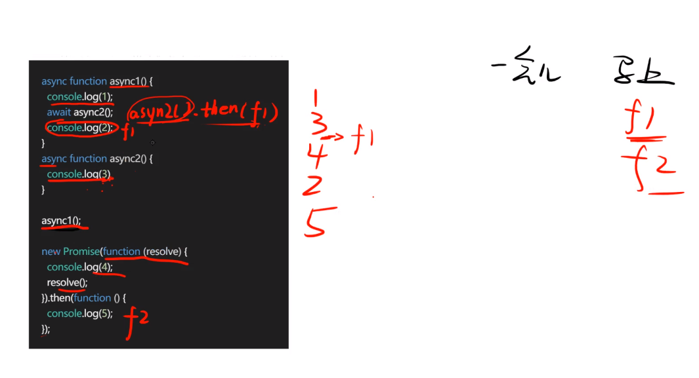
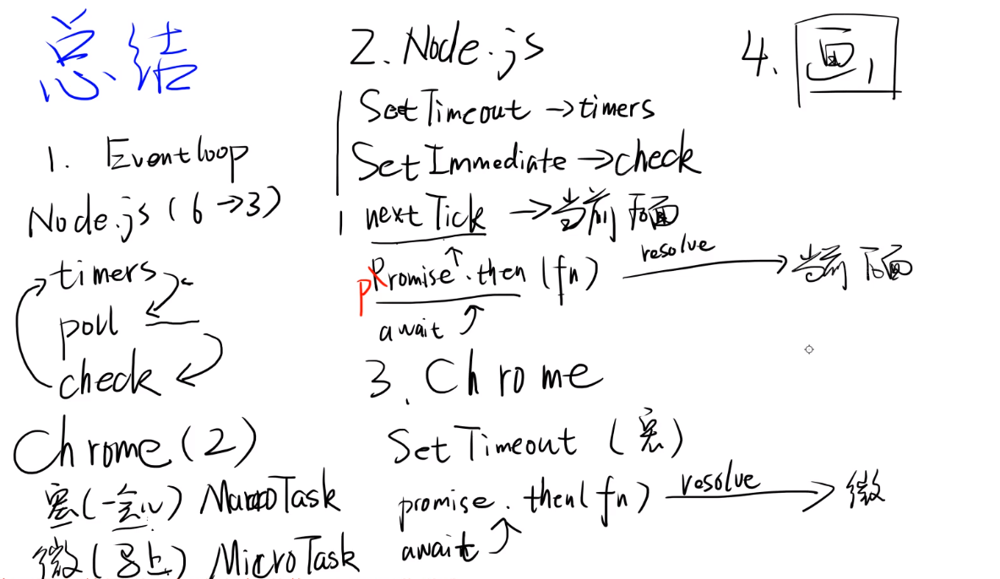

### 痛点
JavaScript 是一种单线程语言，所有任务都在一个线程上完成，一个进程一次只能执行一个任务，只能等前面的任务执行完了，再执行后面的任务。一旦遇到大量任务或者遇到一个耗时的任务，网页就会出现"假死"，因为JavaScript停不下来，也就无法响应用户的行为。

### 1. EventLoop （事件循环）
Event Loop 是一个很重要的概念，指的是计算机系统的一种运行机制。
JavaScript语言就采用这种机制，来解决单线程运行带来的一些问题。

参考阮一峰： http://www.ruanyifeng.com/blog/2014/10/event-loop.html
参考方应杭：https://zhuanlan.zhihu.com/p/34924059

EventLoop事件循环的阶段：


我们要清楚的是 timers（定时器）、poll（轮询）、check（核对）这三种阶段，大部分的面试题也是涉及到的这三个阶段。

```js
// 阶段执行顺序及执行内容 中间省略了部分步骤

timers:  执行 setTimeout，setInterval 回调函数
↓
poll: 等待阶段
↓
check: 执行 setImmediate 的回调函数
```

虽然eventLoop执行顺序是固定的，但是**node开启eventLoop进程和js进程的时间是不固定的**：
> 如果js启动更快，eventLoop则会在timers里执行js里的回调
> 如果eventLoop启动更快，js执行时，eventLoop已经到了 poll 阶段，会执行后面check的回调函数。

**需要注意的是还有一种回调 process.nextTick() 不属于eventLoop的一部分，nextTick队列都是在当前阶段后马上执行。**

```js
// node环境中

setTimeout(()=> { console.log(1)}, 0)
setImmediate(()=> { console.log(2)})
// 打印结果是不固定的，有可能先1后2，也可能是先2后1。

setTimeout(()=>{
  setTimeout(()=> { console.log(1)}, 0)
  setImmediate(()=> { console.log(2)})
}, 1000)
// 上面执行加了延时，所以肯定eventLoop会先启动，所以check里的setImmediate会先执行
// 所以打印结果固定 2,1

setTimeout(()=>{
  setTimeout(()=> { console.log(1)}, 0)
  setImmediate(()=> { console.log(2)})
  process.nextTick(() => { console.log(3)})
}, 1000)
// 刚开始所处阶段是poll, 所以poll阶段后立马执行nextTick, 所以执行顺序：
// 3 2 1

setTimeout(()=>{
  setTimeout(()=> { 
    console.log(1)
    process.nextTick(() => { console.log(4)})
  },0)
  setImmediate(()=> { console.log(2)})
  process.nextTick(() => { console.log(3)})
}, 1000)
// 第一个nextTick是紧跟console.log(1)的，此时阶段是timers，所以timers阶段后会立马执行nextTick
// 3 2 1 4
```

nextTick就看隔它最近的处在什么阶段，它就在该阶段完成之后。

#### 具体的解题步骤：
#### 1. 将函数放置在各个阶段
先将外围函数 setImmediate 和 setTimeout 设置为f1和f2并绑定到 check 和 timers 上。


#### 2. 开始运行eventLoop
默认从poll阶段开始运行，然后到check阶段执行 f1, f1里有setTimeout放置到timers。 进入timers阶段后，首先执f2，然后f3，然后进入poll阶段等待，再次进入check阶段执行f4,
所以打印顺序是：`setImmediate1 setTimeout2 setTimeout1 setImmediate2`



### 2. 不同的环境下的 eventLoop

#### ① Node.js
有6个阶段，这里简化为三个阶段。
```js
// Node.js里不同的api所处阶段
timers: setTimeout setInterval
poll: 等待阶段
check: setImmediate

nextTick当前阶段完成之后调用。
```

#### ② Chrome
只有两个阶段，“一会儿”（宏任务）和“马上”（微任务）。

“宏任务” 指的便是 “any pending JavaScript tasks”，即 事件循环中所有等待执行的JavaScript任务；那什么任务才需要等待执行呢？显然是队列中的任务，所以我更倾向于 宏任务 指的是队列中的任务。

```js
// chrome里不同api所处阶段
setTimeout: '一会儿'（宏任务）
.then(fn): '马上'（微任务）
```

有些面试题，会喜欢考 await，他是promise的语法糖需要转换一下： 
如:
```js
await async2()
console.log(1)
// =>
async2().then(()=>{
  console.log(1)
})

 ```

需要注意的是， `new Promise(fn)` fn会马上执行的。

示例：


上面的解题思路：
> 1. 函数声明不用看，直接走 async1(), async1内部首先打印console.log(1)
> 2. await 改写为 `async2().then(()=>{ console.log(2) })`, `async2()` 会立即执行，打印 `console.log(3)`，然后这里的.then后面的函数放置到 “马上” 阶段里去，暂时不执行，放到后面统一执行。
> 3. 继续往下执行， new Promise 里的函数会立马执行，所以打印 `console.log(4)`。 同样 .then 后面的直接放到 “马上” 阶段里去。
> 最后执行两个马上阶段里的 f1 和 f2。

综上打印出： 1 3 4 2 5 

有微任务就优先执行微任务，然后执行宏任务。




