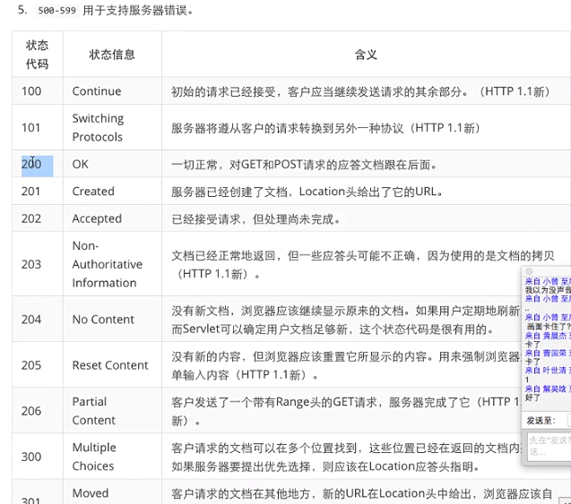
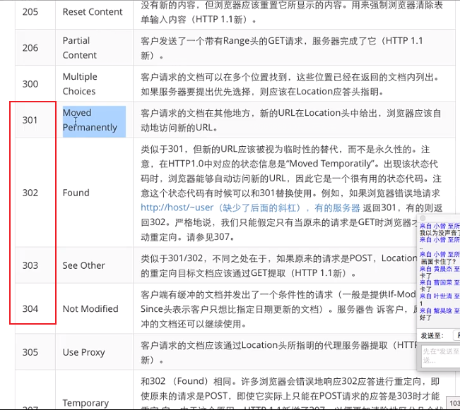
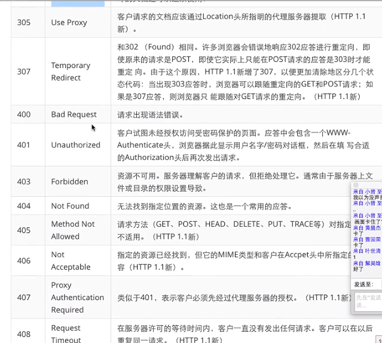
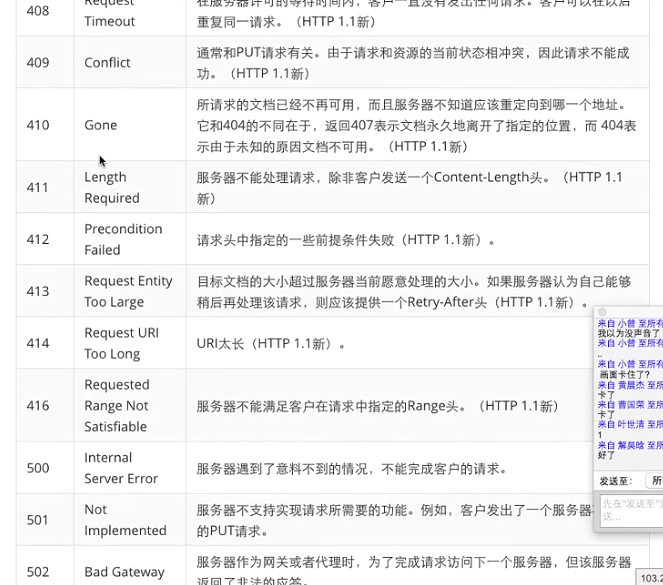
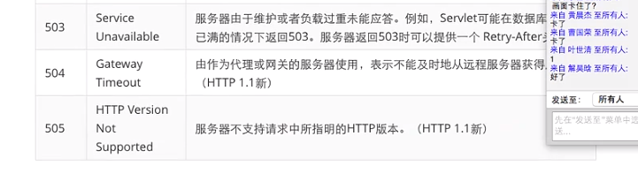
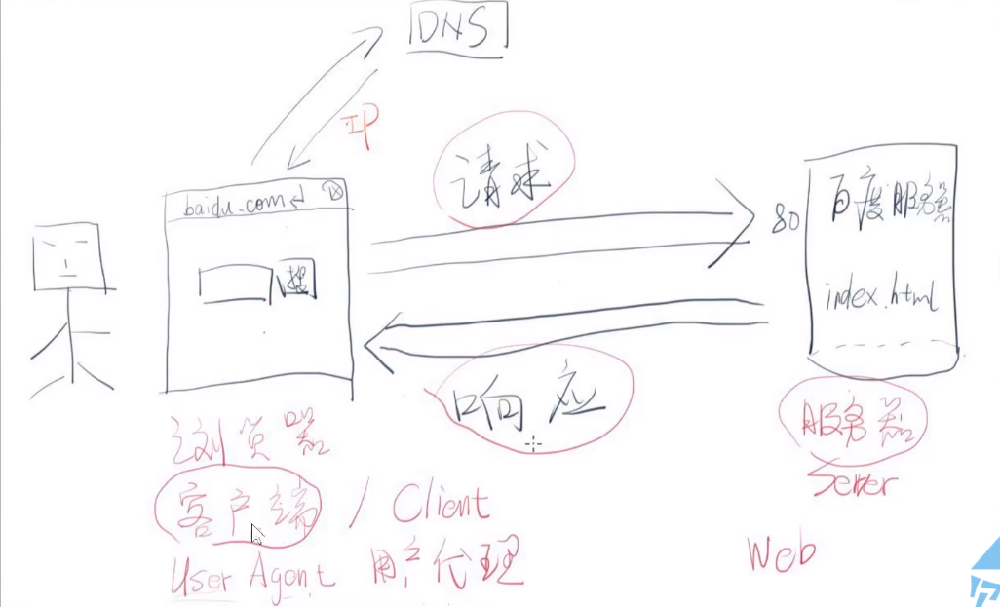
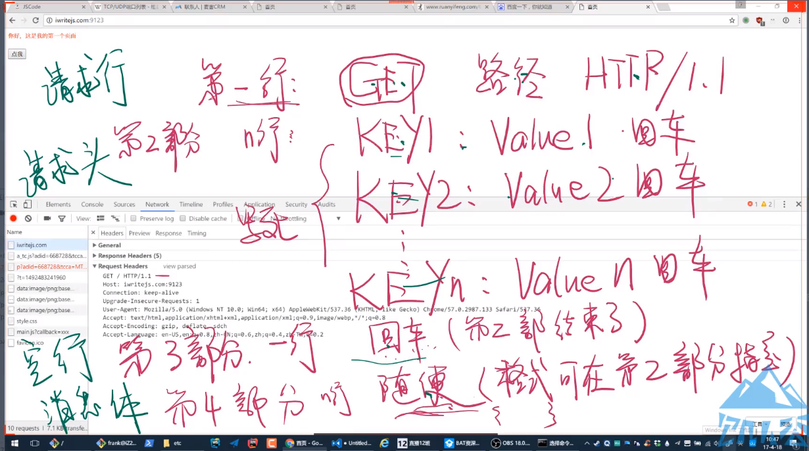
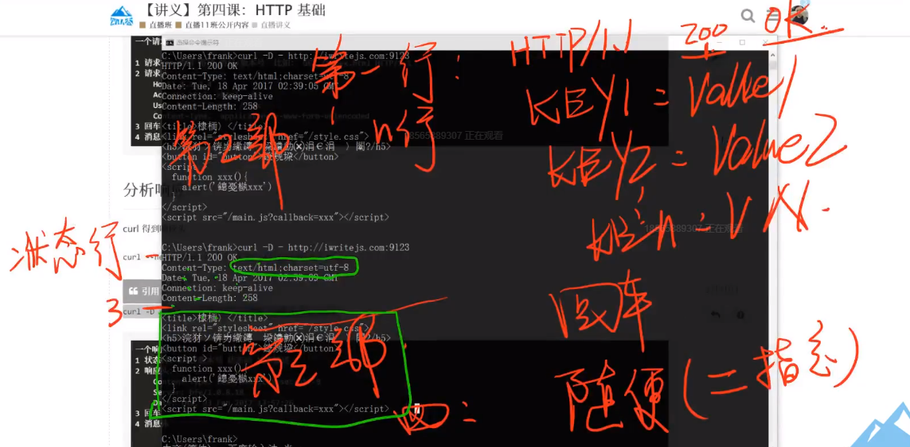
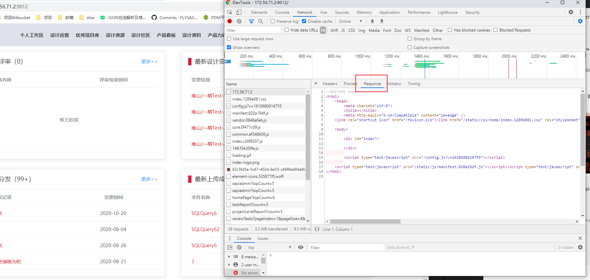

# Http详解

参考：https://zhuanlan.zhihu.com/p/23299600?refer=study-fe
http://book.jirengu.com/fe/%E4%B8%93%E9%A2%98%E6%89%A9%E5%B1%95/HTTP%E4%B8%93%E9%A2%98/url.html

HTTP(HyperText Transfer Protocal): **超文本传输协议**，是一种用于分布式、协作式和超媒体信息系统的应用层协议。

设计HTTP最初的目的是为了**提供一种发布和接收HTML页面的方法**。通过HTTP或者HTTPS协议请求的资源由统一资源标识符（Uniform Resource Identifiers，URI）来标识。


### 1.web本质：
- 用户请求远程资源
- 浏览器查找远程资源，打包用户请求并发送
- 服务器根据用户请求的资源路径及附带参数，配合自身逻辑生成相关内容，发送给浏览器
- 浏览器解析结果，翻译为直观方式呈现

### 2.URI和URL:
- URI(Uniform Resource Identifier): 统一资源标识符
- URL(Uniform Resource Location): 统一资源定位符
与URI相比我们更熟悉URL，URL是使用浏览器等访问web页面的时候需要输入的网页地址：
`http://www.baidu.com`

URI是更通用的资源标识符，URL是它的一个子集

URI由两个主要的子集构成:

1. URL：通过描述资源的位置来描述资源

2. URN：通过名字来识别资源，和位置无关

url里的参数：
例如： http://sj.gtcloud.cn/sso.html?/operation/index.html#/tasksTotalBrowse/3b515acf-24bd-406d-9331-4a167e66af7c?type=personal&isFromBPM=1&return_type=pageUrl
```js

host: 主机名 + 端口                  	// "sj.gtcloud.cn:80"
hostname: 主机名			// "sj.gtcloud.cn"
port: 端口号				// "80"
hash: #开始的锚		 // "#/tasksTotalBrowse/3b515acf-24bd-406d-9331-4a167e66af7c?type=personal&isFromBPM=1&return_type=pageUrl"
search: 以问号开头的参数，到了#号会截掉,没有#号会一直到末尾 // "?/operation/index.html"
origin: 返回URL的协议,主机名和端口号    // "http://sj.gtcloud.cn"
pathname: URL 的相对路径	 // "/sso.html"
```


### 3.状态码
304: 继续用本地缓存







### 4. 报文
accept: 支持的类型 MIME

HTTP报文是在HTTP应用程序之间发送的数据块。这些数据块以一些文本形式的`元信息`开头，描述报文的内容及含义，后面跟着可选的数据部分。


### 5. DNS
DNS作用是将输入的域名 转为对应的 ip, 方便机器识别
输入： 域名
输出： IP




### 6. port 端口
用来区分域名的作用，理论上可以有65536个端口。
- TCP 或 UDP 协议的规则，一个端口对应一个服务
- 0 - 1023 号端口是保留端口，自己使用的话建议使用1024以外的
- 常用端口：
  - 21 端口 - FTP
  - 53 端口 - DNS
  - 80 端口 - HTTP  默认端口，不会显示
  - 443 端口 - HTTPS
  - 1080 端口 - SOCKS 代理

  ### 7. 请求/响应

  #### 请求：
  分为4部分： 请求行(协议信息等)、请求头(key：value的形式)、空行、消息体
  
  ```
  可以使用 curl 模拟一个请求：
  curl -L http://baidu.com

  // 一个请求
  1 请求行： 动词 路径 协议/版本号 比如 GET /index.html HTTP/1.1
  2 请求头
    Host: 172.56.71.2:9012
    Accept: html, xhtml, xml
    User-Agent: Chrome / Mac
    Content-type: application/x-www-form-urlencoded
  3 回车
  4 消息体： username=xxx&password=yyy
  ```

  #### 响应：
  分为4部分： 状态行(协议信息等)、响应头(key：value的形式)、空行、消息体
  
  ```
  使用命令得到响应：
  curl -D - http://172.56.71.2:9012/login.html

  // 一个响应
  1 状态行：协议/版本号 状态码 状态描述
  2 响应头
    Content-Type: text/html;charset=utf-8
    Server: bfe/1.0.8.18
    Date: Thu, 23 Feb 2017 13:57:26
  3 回车
  4 消息体
    <html><body>...
  ```
  chrome响应体是显示在response下的：
  


