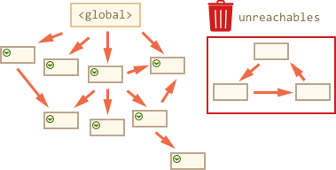

## JS垃圾回收
参考：https://segmentfault.com/a/1190000018605776

### 1. 什么是垃圾？
一般来说没有被引用的对象就是垃圾，有个例外如果几个对象引用形成一个环，互相引用，但根访问不到它们，这几个对象也是垃圾。

```js
// 全局变量a，随时都有可能被用到，所以它不是垃圾
var a = 1;

function fn () {
  // fn执行完后，原来的b就是垃圾，因为每次执行都会产生一个新的b
  var b = 2;
}
fn()

```

局部变量在函数退出以后，就会变成垃圾。

### 2. 如何清除垃圾？
使用 **标记-清除** 算法。步骤：
1. 垃圾回收器获取根并'标记'（记住）它们。
2. 然后它访问并'标记'所有来自它们的引用。
4. 以此类推，直到某个已标记的对象未被引用为止。

##### 第一步标记根：


##### 第二步标记它们以及子孙的引用直到某个对象未被引用：


##### 第三步将不能被访问的对象删除




### 3. 优化回收
基于上面垃圾回收的工作原理，JavaScript引擎应用了许多的优化，使其运行得更快，并且不影响执行。
- **分代回收**：对象分为两组:“新对象”和“旧对象”。存活的对象越久说明被引用的越多，则减少对其的检查。新对象出现，完成它们的工作后很快就会被清理干净。
- **增量回收**：如果有很多对象，如果一次遍历整个对象集，就会花费很多时间，会有延迟。因此引擎将垃圾回收分解多个部分，然后将各个部分分别执行。这需要额外的标记来跟踪变化。
- **空闲时间收集**：垃圾回收器在cpu空闲时运行，减少对执行的可能影响。
