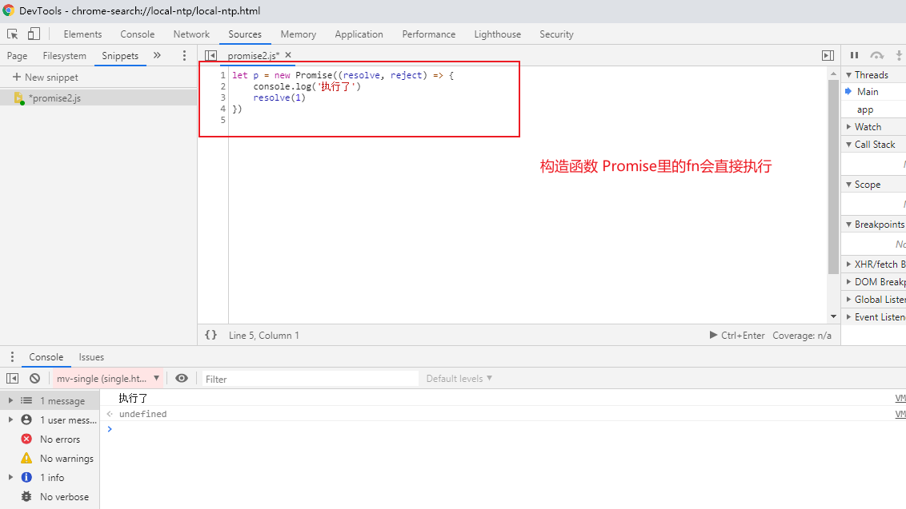
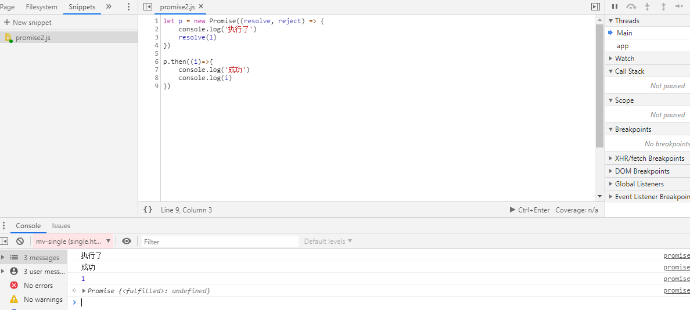

# 手写promise

## 1. promise基本使用：
```js
let p = new Promise((resolve, reject) => {
  // dosth...
  // 成功的话 resolve, 失败的话 reject
  if(/*条件*/) {
    resolve()
  } else {
    reject()
  }
})

p.then(() => {
  // 如果p的状态被resolve, 就进入这里
}, () => {
  // 如果p的状态被reject, 就进入这里
})
```

**上面的代码中，第一段调用了Promise的构造函数（构造阶段），第二段调用了 promise 实例的 .then（调用阶段） 方法。**
我们来解析一下：

### 一. 构造阶段
- 构造函数接受一个函数作为参数
- 构造函数得到实例p的同时，作为参数的函数会**立即执行**。

- 参数函数接受两个参数 resolve, reject
- 参数函数的执行过程中，如果内部调用了resolve, 会将p的状态变为 fulfilled，如果调用reject, 会将p的状态变成 rejected。

### 二. 调用阶段
- 调用.then可以为实例p注册两种状态的回调函数
- 当实例p的状态为fulfilled，会触发第一个函数执行
- 当实例p的状态为rejected，会触发第二个函数执行



## 2. 为什么需要promise?
```js
// 回调地狱
getData1((data1)=>{
  getData2(data1, (data2) => {
    getDta3(data2, (data3) => {
      getData4(data3, (data4) => {
        getData5(data4, (data5) => {
          // 终于拿到data5
        })
      })
    })
  })
})
```
业务场景中经常会有上面业务场景，需要一次次的回调才能拿到最终数据。如果改一下顺序，代码修改起来会非常麻烦。

```js
// promise简写
// 先把getData们全都转成返回promise对象的函数
function getData1() {
  return new Promise((resolve, reject)=>{
    this.$get(url, (data)=>{
      resolve(data)
    })
  })
}
// 然后
getData1()
.then(getData2)
.then(getData3)
.then(getData4)
.then(getData5)
.then(data => {
  // 取到最终data
})
```

用于了promise后，代码会简洁很多，也更加清晰。

## 3. 手写简易版promise
```js
// 因为会new Promise,所以promise需要构造成类
class Promise {
  // 定义成功回调队列和失败回调队列
  successQueue = []
  errorQueue = []
  // 接收一个函数，并回传resolve和reject
  constructor(fn) {
    // 执行成功队列
    const resolve = (data) => {
      setTimeout(()=>{
        this.successQueue.forEach(s => {
          // 可能会出现不传的情况，所以判断一下
          if(s) {
            s(data)
          }
        })
      })
    }
    // 执行失败队列
    const reject = (reason) => {
      setTimeout(()=>{
        this.errorQueue.forEach(e => {
          if(e) {
            e(reason)
          }
        })
      })
    }
    fn(resolve, reject)
  }
  then(s, e) {
    this.successQueue.push(s)
    this.errorQueue.push(e)
    // 保证可以链式调用
    return this;
  }
}

let p = new Promise((resolve, reject) =>{
  if (Math.random() > 0.5) {
    resolve(1)
  } else {
    reject()
  }
})
p.then(()=>{
  console.log('then1')
}, () => {
  console.log('error1')
}).then(()=>{
  console.log('then2')
})
```

注意上面的 promise简易版，是没有实现失败承包制的，意思是比如上面的 error1 触发后，在正常的 promise 里，后面的 .then 会触发成功 then2 函数。
但是简易版是不会触发的，一个失败后，它只会执行所有的失败队列。

