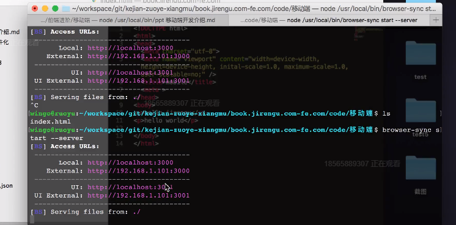
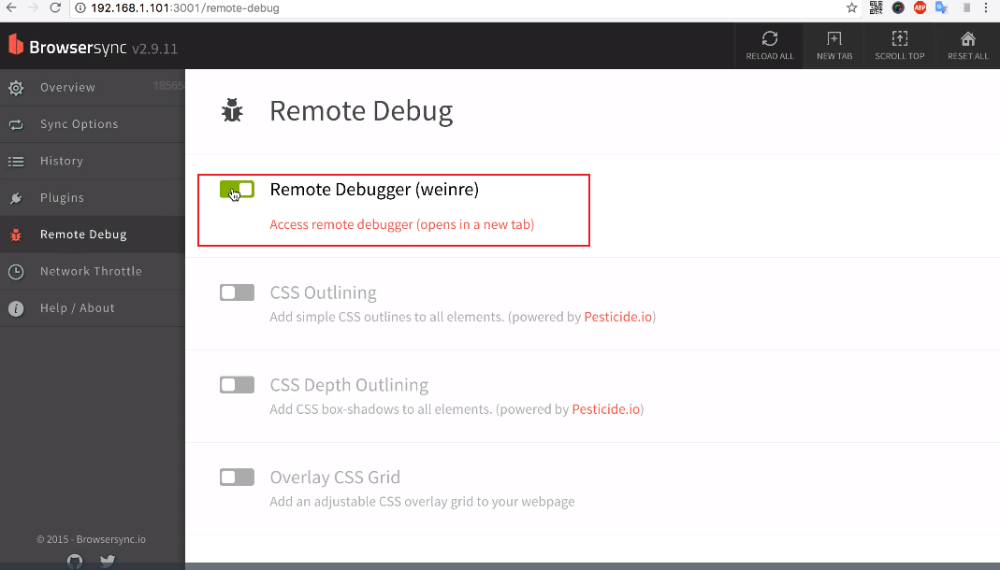
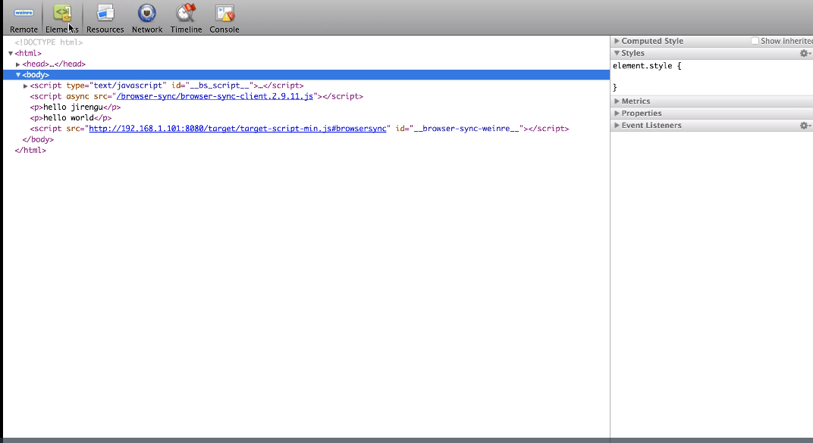

### 1. px、rem、em 的区别

参考： https://zhuanlan.zhihu.com/p/28915418

#### ① px：绝对长度单位
px就不多介绍。

#### ② em：相对长度单位
**使用**：
1. 要知道浏览器的默认字体都是 16px, 那么 
`1em = 16px, 0.75em = 12px, 0.625em = 10px`

2. 这样使用很复杂，过多的小数点很难与px相对应，0.75em 0.625em 全是小数点。

3. 简化font-size的计算，我们在body里会加这一句：
`body { font-size: 62.5%; }  /* 公式 16px*62.5%=10px */`

这样页面中1em=10px,1.2em=12px,1.4em=14px,1.6em=16px，使得视觉、使用、书写都得到了极大的帮助。

缺点：
1、em的值并不是固定的；
2、em会继承父级元素的字体大小（参考物是父元素的font-size；）；
3、em中所有的字体都是相对于父元素的大小决定的；所以如果一个设置了font-size:1.2em的元素在另一个设置了font-size:1.2em的元素里，而这个元素又在另一个设置了font-size:1.2em的元素里，那么最后计算的结果是1.2X1.2X1.2=1.728em

```html
<div class="big">
  我是大字体
  <div class="small">我是小字体</div>
</div>

<style>
  body {font-size: 62.5%; } /*  公式:16px*62.5%=10px  */ 
  .big{font-size: 1.2em}
  .small{font-size: 1.2em} /* 1.2em*1.2em*10=14.4px */
</style>
```

#### ② rem：相对长度单位
与em不同的是，rem要相对于根元素（如：root/html）而不像em一样使用级联的方式来计算尺寸。
**使用**：
1、浏览器的默认字体都是16px，那么1rem=16px，以此类推计算12px=0.75rem，10px=0.625rem，2rem=32px；

2、这样使用很复杂，很难很好的与px进行对应,也导致书写、使用、视觉的复杂(0.75rem、0.625em全是小数点) ；

3、为了简化font-size的换算，我们在根元素html中加入font-size: 62.5%;
`html {font-size: 62.5%;  } /*  公式16px*62.5%=10px  */  `

这样页面中: 1rem=10px,1.2rem=12px,1.4rem=14px,1.6rem=16px;使得视觉、使用、书写都得到了极大的帮助；

**特点**：

1、rem单位可谓集相对大小和绝对大小的优点于一身

2、和em不同的是rem总是相对于根元素(如:root{}或html{})，而不像em一样使用级联的方式来计算尺寸。这种相对单位使用起来更简单。

3、rem支持IE9及以上，意思是相对于根元素html（网页），不会像em那样，依赖于父元素的字体大小，而造成混乱。使用起来安全了很多。

**注意**：
- 值得注意的浏览器支持问题： IE8，Safari 4或 iOS 3.2中不支持rem单位。
- 如果你的用户群都使用最新版的浏览器，那推荐使用rem，如果要考虑兼容性，那就使用px,或者两者同时使用。


动态rem示例：


#### ① 实现移动端动态rem方案的具体步骤：
**1. 浏览器禁止缩放 添加meta**
```html
<meta name="viewport" content="width=device-width, user-scalable=no, initial-scale=1.0, maximum-scale=1.0, minimum-scale=1.0"></meta>
```

**2. 设置根元素字体大小**
```html
<!-- 可根据页面宽度进行基准宽适配 -->
<script>
  let styleStr = `html { font-size: ${document.documentElement.clientWidth / 10}px;`
  let style = document.createElement('style')
  style.innerHtml = styleStr;
  document.head.appendChild(style)
</script>
```

设置完后，1rem = 页面宽度/10  ，这里除以10是为了下面rem小数位友好，但不要设置100，因为浏览器有最小字体限制。

3. 所有单位都用 rem, 所有长度都以页面宽度为基准
```css
// scss
// 使用这个函数就不需要每个都去计算对应的rem了
@function rem($px) {
  $remSize: $px / 根元素字体大小;
  @return #{$remSize}rem;
}

p {
  font-size: rem(16)
}
```


#### ② Retina屏 1px border解决方案：
Retina屏 可能4个像素管去显示以前一个像素管显示的颜色.
1. 获取设备像素比（1/2/3）
2. initial-scale = 1/像素比
3. 让 rem 变为 rem*像素比
4. border-top: 1px solid red;
```html
<script>
  var scale = 1 / window.devicePixelRatio
  document.write(`
    <meta name="viewport" content="initial-scale=${scale}, maximum-scale=${scale}, minimum-scale=${scale}, user-scalable=no">
  `)
</script>
<script>
  var width = document.documentElement.clientWidth / window.devicePixelRatio
  var css = `
    html {
      font-size: ${width / 10 * window.devicePixelRatio }px;
    }
  `
    document.write(`<style>${css}</style>`)
</script>
```
---

### 2. 移动端的开发调试
安装：
```
npm install browser-sync
```

使用：
```
browser-sync start --server  // 启动
```
启动后会看到1browser-sync两个访问链接，第一个可以正常访问你的html，第二个UI External 可以进入后台模式




### 3. 移动端常见库
- zepto
https://www.jianshu.com/p/262d36c1e13e
Zepto是一个轻量级的针对现代高级浏览器的JavaScript 库， 它与jquery 有着类似的api。 如果你会用 jquery，那么你也会用 zepto。Zepto.js在移动端被运用的更加广泛，更注重在移动端的使用。
<br>

- jquery
<br>

- hammerjs
手势库。
<br>

- iscroll
<br>

- fastclick
300ms延迟出现的原因： safari浏览器里点击链接，如何判断是要打开链接还是想要双击操作，**等300ms再判断**
解决300ms延迟.
<br>


移动端问题汇总：
https://github.com/jtyjty99999/mobileTech/blob/master/README.md

