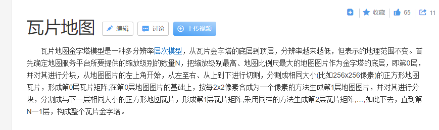
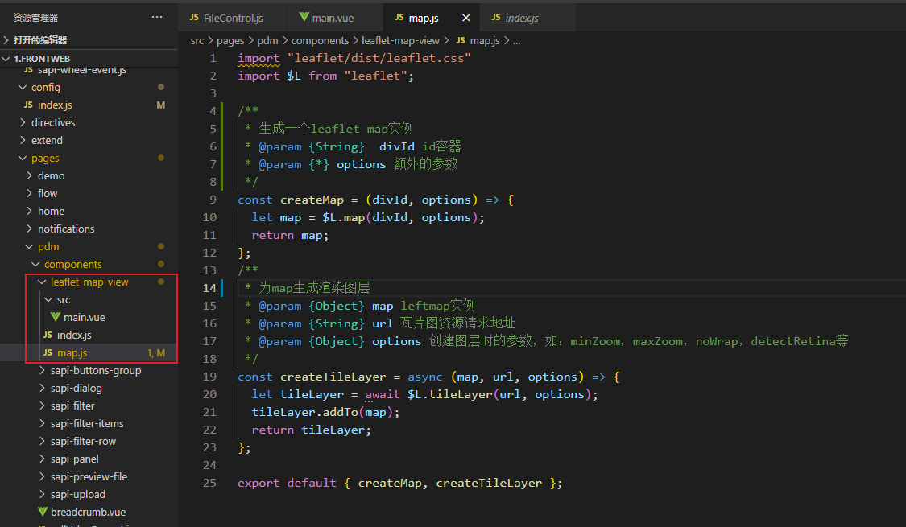
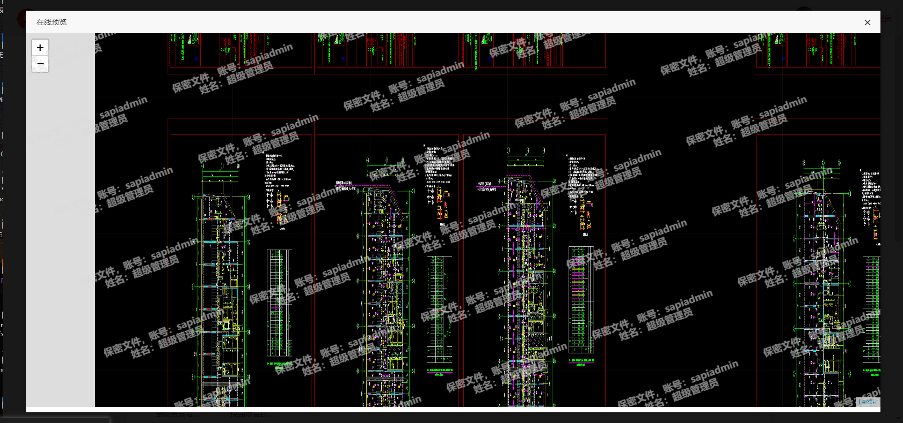

# leaflet 使用

今天项目要求将cad文件预览的方式改为 leafLet.js 瓦片图预览的方式。

没错刚听到这个名词我也和你一样一脸懵逼, 什么是leafLet? 什么又是瓦片图？

好吧自行谷歌 T.T。

官方对leafLet的解释是：
> 一个对移动端优化的交互地图且开源的Javascript库 对于我的实际感受而言，leaflet 是一个十分轻量级的 WebGIS 库。结合其周边资源，对于分析功能需求不那么复杂的 Web GIS 来说足以覆盖到绝大多数功能。

emmm... 关键词 互动地图、代码很轻、兼容旧的浏览器。

那什么是瓦片图：


emmm...挺起来很腻害。
可以理解为将一张很大的图切割成N个小块，然后按顺序绘制在页面上，就像房顶的瓦片一样。


leaflet属于栅格瓦片图，优缺点也很明显：

**优点**： 
- 显示效率高
- 方便传输

**缺点**：
- 占用服务器空间  （一个普通cad文件转成的瓦片图已经快100M了）
- 无法完成像旋转，伪三维等交互显示功能
- 数据保密性差


---
# 如何使用leafLet?
好了，理论知识已经补完，那么我们如何在项目中使用leafLet？

## 1. 安装
```
npm install leaflet --save
```

## 2. 封装leaf-map-view组件
因为很多文件预览都需要用到，所以这里封装成一个常用组件。


```js
// map.js
// 作用是引入leaflet，创建map实例和渲染图层等

// 引入leaflet
import "leaflet/dist/leaflet.css"
import $L from "leaflet";

/**
 * 生成一个leaflet map实例
 * @param {String}  divId id容器
 * @param {Object} options 额外的参数
 */
const createMap = (divId, options) => {
  let map = $L.map(divId, options);
  return map;
};

/**
 * 为map生成渲染图层
 * @param {Object} map leftmap实例
 * @param {String} url 瓦片图资源请求地址
 * @param {Object} options 创建图层时的参数，如：minZoom，maxZoom，noWrap，detectRetina等
 */
const createTileLayer = async (map, url, options) => {
  let tileLayer = await $L.tileLayer(url, options);
  tileLayer.addTo(map);
  return tileLayer;
};

export default { createMap, createTileLayer };
```

```js
// index.js
import View from './src/main';

View.install = function(Vue) {
  Vue.component(View.name, View);
};

export default View;
```

```js
// main.vue
// 组件
<template>
  <div id="sapi-map-container"></div>
</template>

<script>
import map from '../map.js';
export default {
  name: 'leafletMap',
  components: {},
  props: {},
  data() {
    return {
      map: null,
      // 根据接口返回的配置去初始化map，这个接口返回的数据即requestMapData
      optionUrl: '',
      // 请求瓦片图的url地址，后面要后端提供
      OSMUrl: '',
      // mock的数据
      requestMapData: {
        "center" : [ -95.61744015522775, 531.3157937282576 ],
        "maxZoom" : 7,
        "minZoom" : 0,
        "tileSize" : [ 1000, 394 ],
        "zoomLevel" : 0
      }
    };
  },
  computed: {},
  mounted() {
    this.map = map.createMap('sapi-map-container')
    // this.$get(this.optionUrl, {}, (res) => {
    //   this.requestMapData = res
    //   this.createLayer()
    // })
    // 
    this.$nextTick(()=>{
      this.createLayer()
    })
  },
  methods: {
    createLayer() {
      // 设置图的中心位置
      this.map.setView(this.requestMapData.center, this.requestMapData.zoomLevel)
      // 加载 open street map 图层服务
      // 下面url只是我本地开启的一个测试服务器端口，后面后端接口好了以后就换上他们的就行
      this.OSMUrl = 'http://172.56.33.10:3000/preview/{z}/{x}/{y}.png'
      map.createTileLayer(this.map, this.OSMUrl, {
        minZoom: this.requestMapData.minZoom,
        maxZoom: this.requestMapData.maxZoom,
        noWrap: true,
        detectRetina: true
      });
    }
  },
};
</script>
<style lang='less' scoped>
  #sapi-map-container {
    position: absolute;
    left: 0;
    top: 0;
    width: 100%;
    height: 100%;
    z-index: 10;
  }
</style>

```

## 3. 使用leaf-map-view组件
① 常规使用
正常引入该组件即可。
```js
<template>
  <div>
    <leaf-map-view></leaf-map-view>
  </div>
</template>
<script>
import leftMapView from '@/pages/pdm/components/leaflet-map-view';
export default {
  components: {leftMapView},
}
</script>
```

② js调用
因为我们的文件预览是封装在js里的，所以需要js调用。
```js
// fileControl.js
import leftMapView from '@/pages/pdm/components/leaflet-map-view';

// 以下代码为简化版，与实际业务代码有出入，大致流程差不多
const div = document.createElement('div')
document.body.appendChild(div)
const Constructor = Vue.extend(leftMapView)
const vm = new Contructor({}).$mount(div)


// 最后记得找个时机(比如关闭弹窗时)清除掉新增的div，以免重复累加，影响页面性能
document.body.removeChild(div)
```

最终预览效果：


